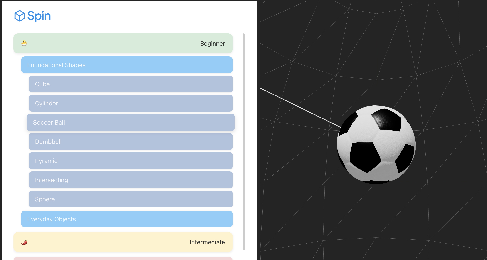
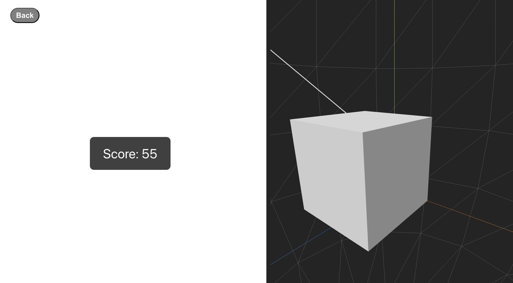
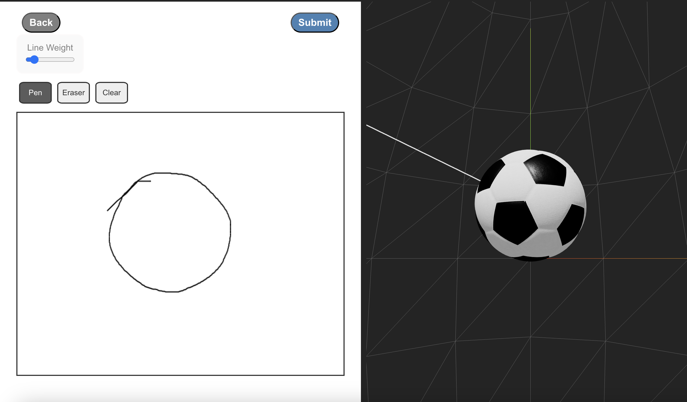

This app is created for 
By looking at the object from different perpsctives for 30 seconds, 
the user will draw on perspective of the project that an arrow points to,
A white board will be provided, then the application will compare the drawing 
and the actual object and gives it a score.
# 🧠 Project Title

> Drawing practice with 3D spatial object.

---

## 📸 Screenshots

<!-- Add screenshots or demo GIFs -->




---

## 🚀 Features

- ✨ Feature 1
- ⚡ Feature 2
- 🔒 Feature 3

---

## 🛠️ Tech Stack

**Frontend:** React / HTML / CSS  
**Backend:** Node.js / Express  
**Database:** MongoDB / PostgreSQL  
**Tools:** Git, Docker, AWS, etc.

---

## 📦 Installation

```bash
# Clone the repo
git clone https://github.com/yourusername/yourproject.git
cd yourproject

# Install dependencies
npm install

# Run the app
npm start


### Installation
```bash
npm install
```

### Run the app
```bash
npm run dev
```